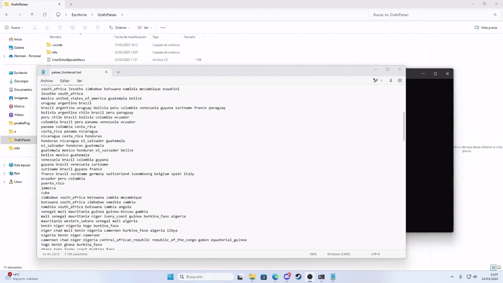
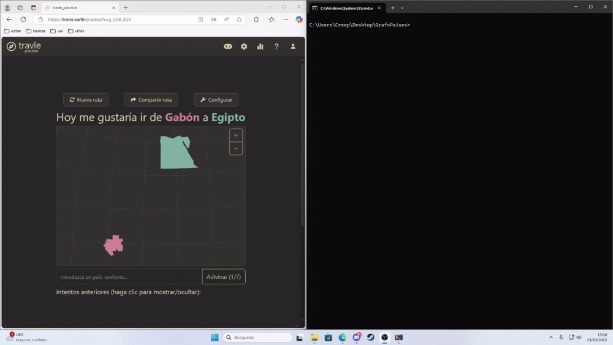
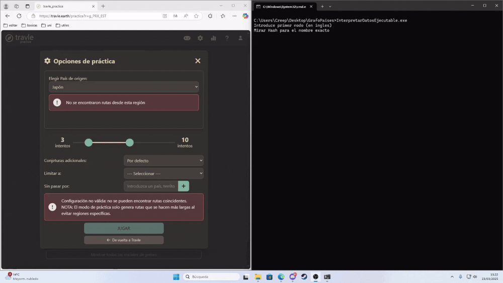

# Proyecto de Mapeo de Adyacencias entre Entidades

Este proyecto está diseñado para analizar y mapear relaciones de adyacencia entre entidades (como países, ciudades, nodos, etc.) utilizando una matriz de adyacencias y un conjunto de mapas hash que relacionan los nombres de las entidades con identificadores numéricos. El proyecto consta de dos archivos principales: `main.cc` y `ObtenerDatos.cc`, que se encargan de la lógica principal y la generación de datos respectivamente.

## Descripción del Proyecto

El proyecto permite:
1. **Generar datos de adyacencia**: A partir de un archivo de texto que contiene las relaciones de adyacencia entre entidades, se generan archivos de mapas hash y una matriz de adyacencias.
2. **Consultar adyacencias**: Dada una entidad, se pueden listar todas las entidades adyacentes.
3. **Verificar si dos entidades son adyacentes**: Se puede verificar si dos entidades específicas son adyacentes.
4. **Encontrar la ruta más corta entre dos entidades**: Se puede encontrar la ruta más corta entre dos entidades, excluyendo ciertas entidades si es necesario.

## Estructura del Proyecto

(Revisa los archivos para mayor precisión)
- **LogicaPrincipal.hh**: Contiene la lógica principal del programa, incluyendo funciones para leer mapas hash y matrices de adyacencias, verificar adyacencias, y encontrar rutas óptimas entre entidades.
- **ObtenerDatos.hh**: Contiene funciones para generar los archivos de mapas hash y la matriz de adyacencias a partir de un archivo de texto que contiene las relaciones de adyacencia.

## Archivos Generados

El proyecto genera los siguientes archivos en la carpeta `info`:
- **hashMapIntToString.txt**: Mapa que relaciona identificadores numéricos con nombres de entidades.
- **hashMapStringToInt.txt**: Mapa que relaciona nombres de entidades con identificadores numéricos.
- **matriz_de_adyacencia.txt**: Matriz de adyacencias que indica las relaciones entre entidades.

## Uso

Tenemos `InterpretarDatosEjecutable.cc` y `CrearDatosEjecutable.cc`, los cuales ya están preparados para su uso, junto con sus respectivos archivos `.exe` que deben ejecutarse desde la terminal.

- **CrearDatosEjecutable.cc**: Dado un archivo con la siguiente estructura: (nodo) (nodos adyacentes) (y así para todos los nodos), mirar "paises_fronteras1.txt" como ejemplo, genera en la carpeta `info` todos los archivos necesarios.
- **InterpretarDatosEjecutable.cc**: Utilizando los archivos `.txt` de la carpeta `info`, solicita el nombre de dos nodos, seguido de una lista (que puede estar vacía) de nodos no visitables, y devuelve el camino más corto entre ellos o un camino vacío en caso de que no sean conexos.

## Objetivo

El objetivo es aplicar una modificación del algoritmo BFS, el cual nos permite encontrar el camino más óptimo en dicha matriz de adyacencias. De esta manera, de forma sencilla, puedes obtener caminos y distancias óptimas entre nodos, utilizando un formato muy simple.

También, los archivos .hh junto con sus respectivos .cc permiten a cualquiera utilizar las funciones según sea necesario, siempre que se cumplan las condiciones, como la existencia de los archivos requeridos. Además, están comentados con explicaciones de lo que hacen y son fácilmente interpretables.

## Ejemplo (con gifs)

Este ejemplo se puede extrapolar a cualquier otro caso parecido.

### Bot para Travle

Es una web en la que, dados dos países, debes conectarlos de la forma más óptima. Con el archivo `paises_fronteras1.txt`, obtenemos el camino más óptimo en la mayoría de los casos. Si el camino falla, es debido a un error en la matriz de adyacencias.

- **Carga de los datos**:
  Cargando los datos que hay en el archivo "paises_fronteras1.txt", que contienen la relación de cada país con sus fronteras.  
  

- **Un ejemplo**:
  Una partida normal.  
  

- **Excluyendo un país a visitar**:
  Como excluir un país, se pueden prohibir los que sean necesarios.  
  

- **Sin camino**:
  Una petición sin solución.  
  

- **Ejemplo de varias partidas seguidas**:
  Una serie de partidas largas.  
  

